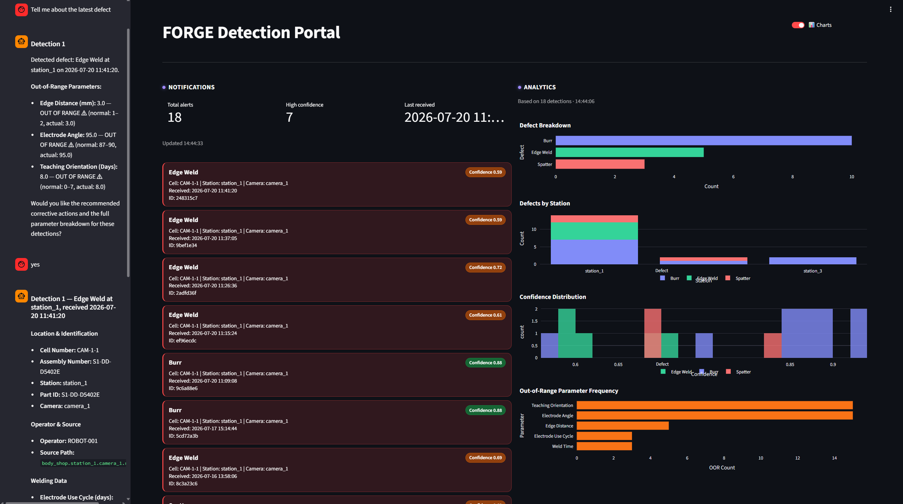
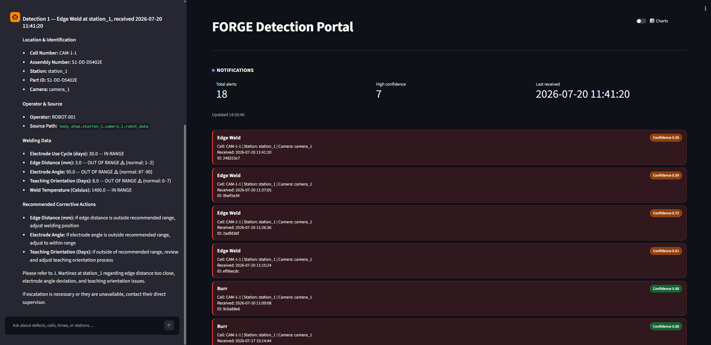

# FORGE Detection Portal

**Purpose:** Detects manufacturing weld defects from camera images using a local YOLO vision app, transports detection events to a cloud-connected server stack, and exposes a conversational AI interface for engineers to query and analyze detections in natural language.

**Status:** In development  

**Project type:** Software

---

## Preview

*Full dashboard: real-time detection feed (center), AI chat interface (left), analytics charts (right).*

*AI chat panel: structured detection breakdown, out-of-range welding parameters, recommended corrective actions, and operator escalation guidance.*

---

## Index

| Document | Location |
|---|---|
| Architecture & data flow | [docs/ARCHITECTURE.md](projects/FORGE/docs/ARCHITECTURE.md) |
| Components & workstreams | [docs/COMPONENTS.md](projects/FORGE/docs/COMPONENTS.MD) |
| Processes & pipelines | [docs/PROCESSES.md](projects/FORGE/docs/PROCESSES.md) |
| Reference inputs (read-only) | [docs/SOURCES.md](projects/FORGE/docs/SOURCES.md) |
| Operational data stores | [docs/DATA_AND_SYSTEMS.md](projects/FORGE/docs/DATA_AND_SYSTEMS.md) |
| External integrations | [docs/INTEGRATIONS.md](projects/FORGE/docs/INTEGRATIONS.md) |
| Environment & credential register | [docs/CONFIG.md](projects/FORGE/docs/CONFIG.md) |
| Operations, diagnostics, recovery | [docs/RUNBOOK.md](projects/FORGE/docs/RUNBOOK.md) |
| Decision record | [docs/DECISIONS.md](projects/FORGE/docs/DECISIONS.md) |
| Owners & contacts | [docs/STAKEHOLDERS.md](projects/FORGE/docs/STAKEHOLDERS.md) |
| Version history | [docs/CHANGELOG.md](projects/FORGE/docs/CHANGELOG.md) |

---

## Environments / locations

| Environment | Location |
|---|---|
| Local vision app | Vision-processing host (shop floor) — see CONFIG.md |
| Server stack (EC2) | `g4dn.xlarge`, private subnet — SSH via `forge-server.intern-app-sbx-001.sctmtrs.xyz` |
| S3 bucket | `forge-project-data` (us-east-2) — see CONFIG.md |
| Dashboard UI | `https://forge-alb.intern-app-sbx-001.sctmtrs.xyz/` — Scout device + Zscaler required |

---
Architecture diagrams: 
https://scoutmotors-my.sharepoint.com/:u:/p/joshua_wigfall/IQCr_yhG1qM3Qrix9R0y4T_NAc4OK8Ier0P-eGZ_y_yrogs?e=3ZY7t6

https://lucid.app/lucidchart/f60d1808-3fcb-45b9-876f-23c8d0822d2a/edit?viewport_loc=-2557%2C-6067%2C9961%2C4722%2C0_0&invitationId=inv_371c12d2-4c94-42a2-8929-ba82f44ac5dc
## On failure, begin at [docs/RUNBOOK.md](projects/FORGE/docs/RUNBOOK.md).
